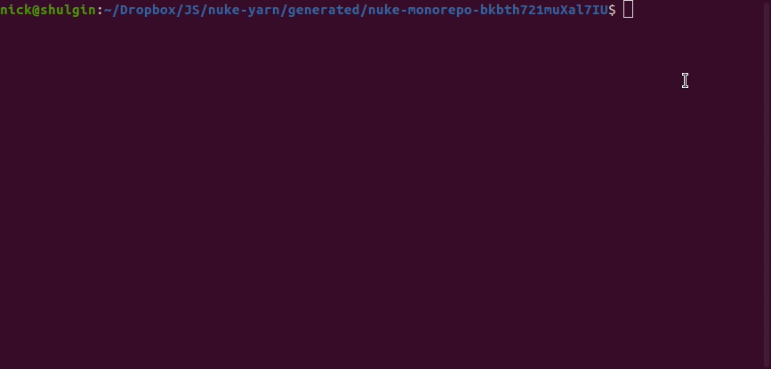

# Nuke Yarn

<div align="center">
  <p align="center">
      
  </p>
  <sub>It's the only way to be sure</a></sub>
</div>

[![npm package][npm-img]][npm-url]
[![Build Status][build-img]][build-url]
[![Downloads][downloads-img]][downloads-url]
[![Issues][issues-img]][issues-url]
[![Code Coverage][codecov-img]][codecov-url]
[![Commitizen Friendly][commitizen-img]][commitizen-url]
[![Semantic Release][semantic-release-img]][semantic-release-url]

Deletes all node_modules folders and yarn.lock files in a Yarn project, including workspaces

## Install

It's recommended to use a global installation, so you can use this in any project:

```bash
npm install -g nuke-yarn
```

## Usage

### CLI

Simply run `nuke-yarn` in the root of your project:

```bash
$ nuke-yarn
```

You can also pass a working directory instead of `cd`ing to the root of your project:

```bash
$ nuke-yarn --cwd /path/to/project
```

Pass `--help` to see all options:

```bash
$ nuke-yarn --help
Delete all node_modules and yarn.lock files in the current project

USAGE
  $ nuke-yarn [-c <value>]

FLAGS
  -c, --cwd=<value>  [default: .] Working directory for the project

DESCRIPTION
  Delete all node_modules and yarn.lock files in the current project
```

### JS/TS API

```ts
import { clean } from "nuke-yarn";

clean(); // Defaults to current working directory
clean("/path/to/project"); // Pass a working directory
```

## Development Status

This project uses [semantic-release](https://github.com/semantic-release/semantic-release) for versioning.
Any time the major version changes, there may be breaking changes. If it is working well for you, consider
pegging to the current major version, e.g. `nuke-yarn@v1`, to avoid breaking changes. Alternatively,
you can always point to the most recent stable release with the `nuke-yarn@latest`.

## Developing

Clone the repo and then run `npm install` to set up the pre-commit hooks.

Run `npm run dev` to start the development server, and `npm run build` to create a production build
of the library.

The library files are stored in `src`, while the files for the development page are in `dev-src`.

## Author

The original `clean.js` script was created by [Miguel Bermudez](https://github.com/miguelbermudez). It was then converted to TypeScript and adapted into
a CLI library with tests by Nick DeRobertis. MIT License.

[build-img]: https://github.com/nickderobertis/nuke-yarn/actions/workflows/release.yml/badge.svg
[build-url]: https://github.com/nickderobertis/nuke-yarn/actions/workflows/release.yml
[downloads-img]: https://img.shields.io/npm/dt/nuke-yarn
[downloads-url]: https://www.npmtrends.com/nuke-yarn
[npm-img]: https://img.shields.io/npm/v/nuke-yarn
[npm-url]: https://www.npmjs.com/package/nuke-yarn
[issues-img]: https://img.shields.io/github/issues/nickderobertis/nuke-yarn
[issues-url]: https://github.com/nickderobertis/nuke-yarn/issues
[codecov-img]: https://codecov.io/gh/nickderobertis/nuke-yarn/branch/main/graph/badge.svg
[codecov-url]: https://codecov.io/gh/nickderobertis/nuke-yarn
[semantic-release-img]: https://img.shields.io/badge/%20%20%F0%9F%93%A6%F0%9F%9A%80-semantic--release-e10079.svg
[semantic-release-url]: https://github.com/semantic-release/semantic-release
[commitizen-img]: https://img.shields.io/badge/commitizen-friendly-brightgreen.svg
[commitizen-url]: http://commitizen.github.io/cz-cli/
